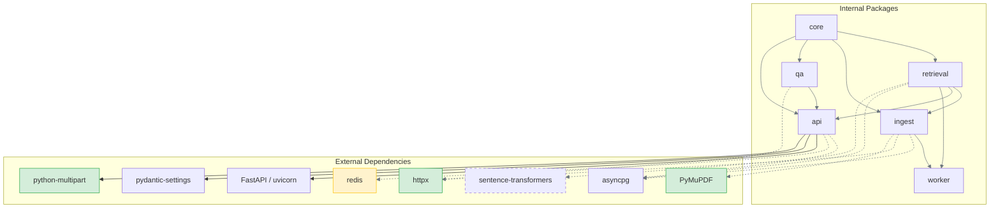
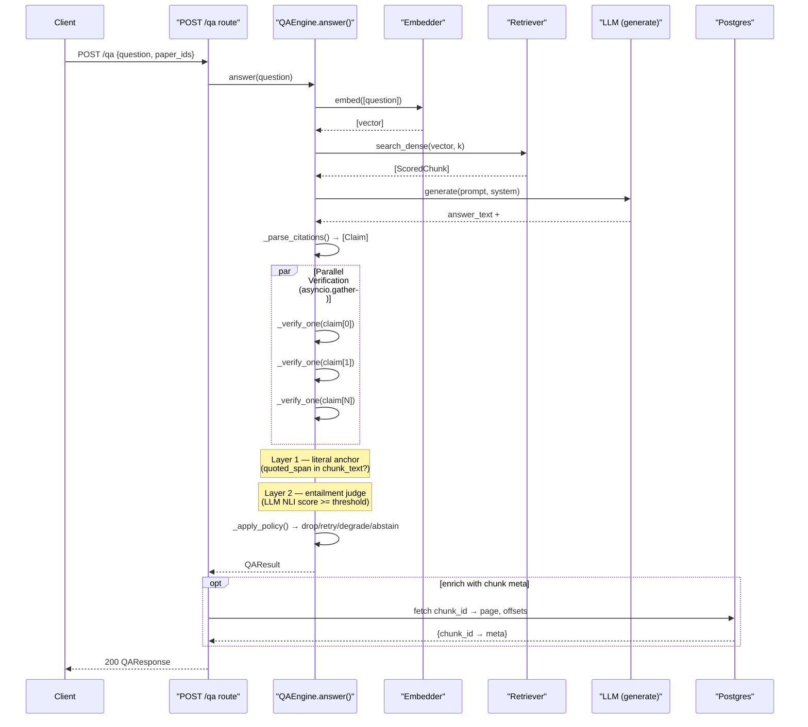

# Architecture

## 2026-06-22 — Phase 0.2: Dependency Audit, Drift Remediation & Maintainability

### Component Diagram — Changed Components

**Legend:**
- 🟢 `PyMuPDF`, `httpx`, `python-multipart` — added to explicit `[dependencies]` in this phase
- 🟡 `redis` — pin tightened from `>=5` to `>=5,<9`
- ⚪ `sentence-transformers` — moved to optional `[embedding]` extra
- Removed from infra: MinIO service & `S3_ENDPOINT` env vars (deferred to v0.2)

### Sequence Diagram — QA Verification Loop (Parallelized)

**What changed in this phase:** The verification loop (highlighted `par` block) was parallelized from sequential `for claim in claims: await verify(claim)` to `asyncio.gather(...)`. This reduces answer latency proportionally to claim count — the dominant cost (LLM NLI calls) now runs concurrently instead of serially.
